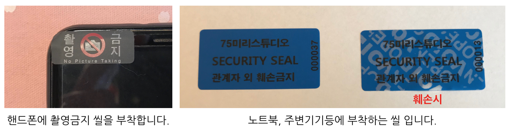

# 방문객 보안 / Visitor Security Policy
방문객 보안지침입니다.
MPAA 관련규칙 : PS-2.0, PS-2.1, PS-2.2, PS-2.3, PS-3.0

This is document for visitor security policy.
MPAA-related rule :  PS-2.0, PS-2.1, PS-2.2, PS-2.3, PS-3.0

## 방문객 정보/Visitor Information
- 방문자 기록표에 방문기록을 작성합니다.
	- 날짜(visit_date)
	- 방문자 이름(visitor_name)
	- 방문 대상(visited_to)
	- 회사/소속(company)
	- 씰번호(seal_number)
	- 차량번호(vehicle_number)
	- 방문 목적(visit_subject)
	- 방문객 서명(visitor_sign)
	- 방문 시작시간(starttime)
	- 방문 종료시간(endtime)
	- 방문자 목걸이 번호(visiting_card_number)

- 방문객에게 방문자 목걸이를 지급합니다. 방문객 목걸이는 임시 출입권한을 가지고 있습니다.
- 방문객의 핸드폰에 카메라 씰을 부착합니다.
- 기본교육
	- USB, 외장하드 사용을 제한합니다.
	- 업무상 노트북을 사용한다면 보안씰을 부착합니다.
	- 노트북, 개인 장비에서 인터넷을 사용해야 한다면 손님용 Wifi를 알려줍니다.
	- 업무협의로 프로젝트 관련 미팅을 진행한다면 보안서약서를 작성합니다.
	
- 프로젝트와 밀접한 관련이 있지만 정보가 없는 첫 방문자는 사진이 있는 신분증으로 신분확인을 합니다.
	- 유효한 신분증 : 국가에서 지정한 신분증. 예를 들어 여권, 주민등록증, 운전면허증이 있습니다.

- [방문객 양식 다운로드](../pdf/visitor_table.pdf)

- Visitors shall fill in visitors log with the following elements.
	- visit_date
	- visitor_name
	- visited_to
	- company
	- seal_number
	- visit_subject
	- visitor_sign
	- start_time
	- end_time
	- visiting_card_number

- Visitors are given visiting cards. The visiting card indicates temporary access rights.
- Security seals shall be attached to cameras of visitor's mobile phones.
- basic security education for visitors:
	- It is banned to use USB and external hard disk.
	- If a visitor needs to use a laptop for the Business reason, security seal shall be attached to it.
	- If a visitor needs to use private devices such as a laptop, the visitor may use guest Wifi.
	- In the case of having a meeting for the purpose of business, NDA shall be drawn up in advance. 
- If a visitor is closely related to Project, Company confirms the identity by identification card on the visitor's first visit.
	- Validate identifications are as follow.
		- passport
		- certificate of residient registrantion
		- driver's license
		- government-issued identification.
		
- [Download Visitor Form](../pdf/visitor_table.pdf)
	
## 씰 부착예시 / How to attach seal

## 핸드폰 카메라 씰 구매처 / Online buying source of Security seal for Mobile phone camera
- http://koreaseals.com/product_detail.php?no=69

## 방문객 Name Plate / Visitor Name Plate
- [방문객 Name Plate 양식다운로드](../pdf/visitor_nameplate.pdf)
- [Download Visitor Name Plate Form](../pdf/visitor_nameplate.pdf)

## 참고사항 / Remark
- 방문객 정보란에 표기된 각 항목의 영문표기는 AWS DynamoDB Attribute로 사용할 수 있는 키워드로 작성되어 있습니다. 추후 서류가 아닌 DB로 방문객 시스템을 구축할 때 위에 선언된 영문표기를 사용합니다.
- Each element of visitors log is drawn up with keywords which can be ported to AWS DynamoDB Attribute. In the case of system buildup with DB not with documents, use the aforementioned English notation.
