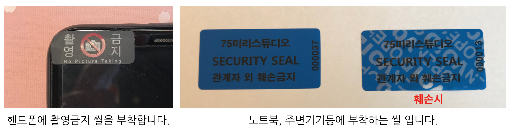

# Visitor Security Policy
This is document for visitor security policy.
MPAA-related rule :  PS-2.0, PS-2.1, PS-2.2, PS-2.3, PS-3.0

## Visitor Information
- Visitors shall fill in visitors log with the following elements.
	- visit_date
	- visitor_name
	- visited_to
	- company
	- seal_number
	- visit_subject
	- visitor_sign
	- start_time
	- end_time
	- visiting_card_number

- Visitors are given visiting cards. The visiting card indicates temporary access rights.
- Security seals shall be attached to cameras of visitor's mobile phones.
- Basic security education for visitors:
	- It is banned to use USB and external hard disk.
	- If a visitor needs to use a laptop for the Business reason, security seal shall be attached to it.
	- If a visitor needs to use private devices such as a laptop, the visitor may use guest WIFI.
	- In the case of having a meeting for the purpose of business, NDA shall be drawn up in advance. 
- If a visitor is closely related to Project, Company confirms the identity by identification card on the visitor's first visit.
	- Validate identifications are as follows.
		- Passport
		- Certificate of resident registration
		- Driver's license
		- Government-issued identification.
		
- [Download Visitor Form](../pdf/visitor_table.pdf)
	
## How to attach seal

## Online buying source of Security seal for Mobile phone camera
- http://koreaseals.com/product_detail.php?no=69

## Visitor Name Plate
- [Download Visitor Name Plate Form](../pdf/visitor_nameplate.pdf)

## Remark
- Each element of visitors logs is drawn up with keywords which can be ported to AWS DynamoDB Attribute. In the case of system buildup with DB not with documents, use the aforementioned English notation.
