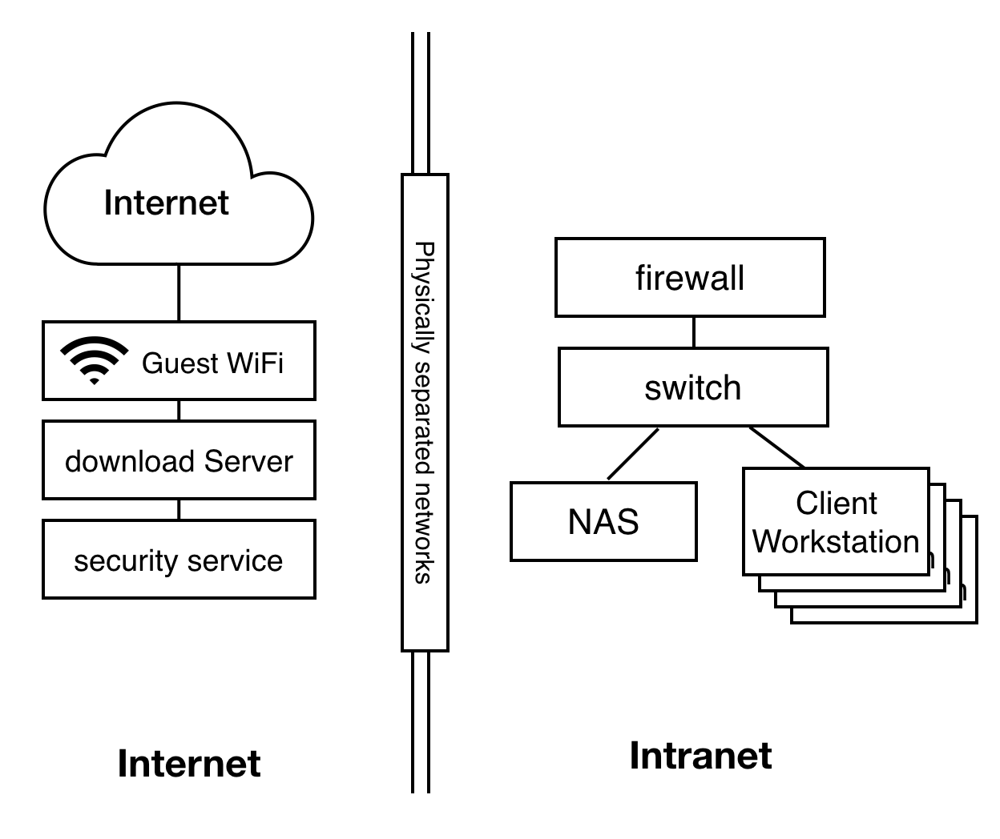

# Network, Server
인터넷망과 인트라넷망은 물리적으로 완전히 분리되어있습니다.
MPAA 관련규칙 : DS-3.0, MS-6.0, DS-1.6

Internet network and Intranet network is physically separated.
MPAA-related rule : DS-3.0, MS-6.0, DS-1.6

## 방화벽 / Firewall
- 담당업체 : 아이티레이
- 외부에서 방화벽을 원격관리 할 수 없도록 한다. DS-1.6
- 외부에서 회사 물리IP로 ping명령어를 할 수 없도록 설정

- Subcontractor : ITRAY Corp.
- The firewall shall not be managed in a remote environment outside the company. DS-1.6

## 서버접근 / Server Access
- 지문이 등록된 관리자만 접근가능하며 서버실까지 총 3중 인증단계를 거쳐야합니다.
- CCTV 는 항상 녹화중이다.
- 보안관리자(정)은 항시 스마트폰 어플리케이션을 이용하여 핸드폰으로 CCTV를 실시간 확인 가능합니다.

- Only authorized sever manager whose fingerprint is enrolled may access to the server room.
- Server manager shall pass 3-step verification to access server room.
- The server room is recorded via CCTV 24 hours a day.
- Security official(main) can watch server room in real time via a mobile application.

## 인터넷 / Internet
- 손님용 WIFI를 이용해서 인터넷 사용이 가능합니다.
- The Internet is available via guest WIFI.

## 인트라넷 / Intranet
- 아티스트의 모든 컴퓨터는 인터넷과 물리적으로 분리된 네트워크를 사용합니다.
- 회사 내부에 사용하지 않는 랜소켓은 보안씰이 부착되어야 합니다.

- Without exception, computers of artists shall use a physically separated network from the internet.
- Secure seals should be attached to LAN sockets not used inside the company.

## UPS(Uninterruptible Power Supply)
주요 장비는 UPS에 물려있으며 정전시 가용시간은 30분입니다.(MPAA 기준 시간은 최소 15분입니다.)

Main Device is connected to UPS. Available time of UPS is 30 minutes.(According to MPAA, minimum available time is 15 minutes.)

## 네트워크 구성도/Network Block Diagram

